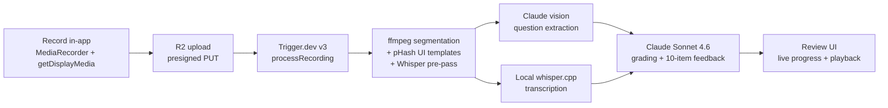

<div align="center">

# CPA Study Servant

**AI-powered CPA exam coach that watches you work, listens to you think, and grades both your answer and your reasoning.**

[](https://code.claude.com)
[](https://www.typescriptlang.org/)
[](https://nextjs.org/)
[](https://trigger.dev)
[](https://github.com/ggerganov/whisper.cpp)
[](LICENSE)

</div>

---

## What it does

You record yourself working through Becker CPA practice questions. The app:

1. Captures your screen + your voice.
2. Splits the recording into one clip per question using ffmpeg scene detection, verbal cues from local Whisper, and perceptual-hash template matching against Becker's UI.
3. Transcribes your reasoning locally with `whisper.cpp` — **your audio never leaves your machine**.
4. Extracts the question, choices, your answer, and Becker's explanation from keyframes using Claude vision.
5. Grades both your **accounting knowledge** (0–10) and your **verbal consulting technique** (0–10), then returns a 10-item structured feedback payload.
6. Tracks progress across sessions, surfaces weak topics every 100 questions, and grounds explanations in your uploaded textbooks (Phase 2).

## Architecture



## Stack

- Next.js (App Router) + Tailwind
- TypeScript strict, Node 22, pnpm
- Prisma + Postgres (Neon in prod, Docker locally)
- Trigger.dev v3 for all long-running work
- Cloudflare R2 for blobs
- `whisper.cpp` via `smart-whisper` for transcription (local, zero per-minute cost)
- Claude Sonnet 4.6 via OAuth-authenticated Claude Code during dev; Anthropic API in prod
- `ffmpeg` for video work

## Development

``` bash
pnpm install
docker compose up -d postgres
pnpm prisma migrate dev
pnpm dev               # Next.js
npx trigger.dev@latest dev   # Trigger.dev
```

## Sam's input folder

Drop voice memos into `sam-input/audio/` or edit `sam-input/TODO.xml` and save. A hook transcribes the audio with local Whisper and calls Claude Code to act on whatever you dictated — overnight or while you're at work. See `sam-input/README.md` for the schema.

## Status

Phase 1 MVP under autonomous build. See `BUILD_LOG.md` for the overnight build report, and `PLAN.md` for the full task breakdown.
